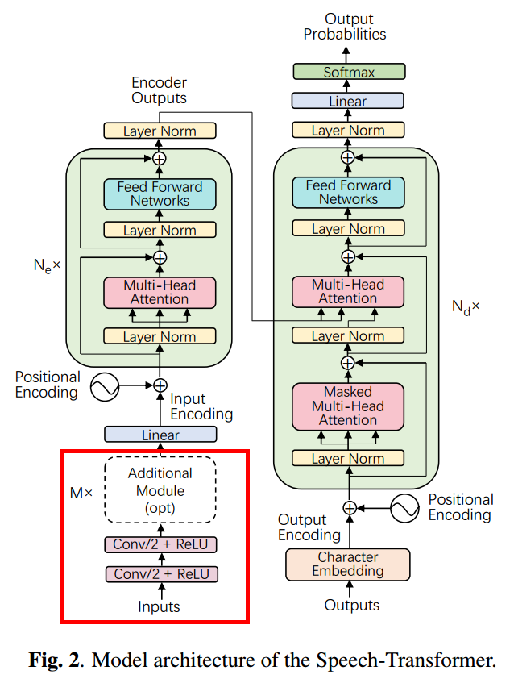
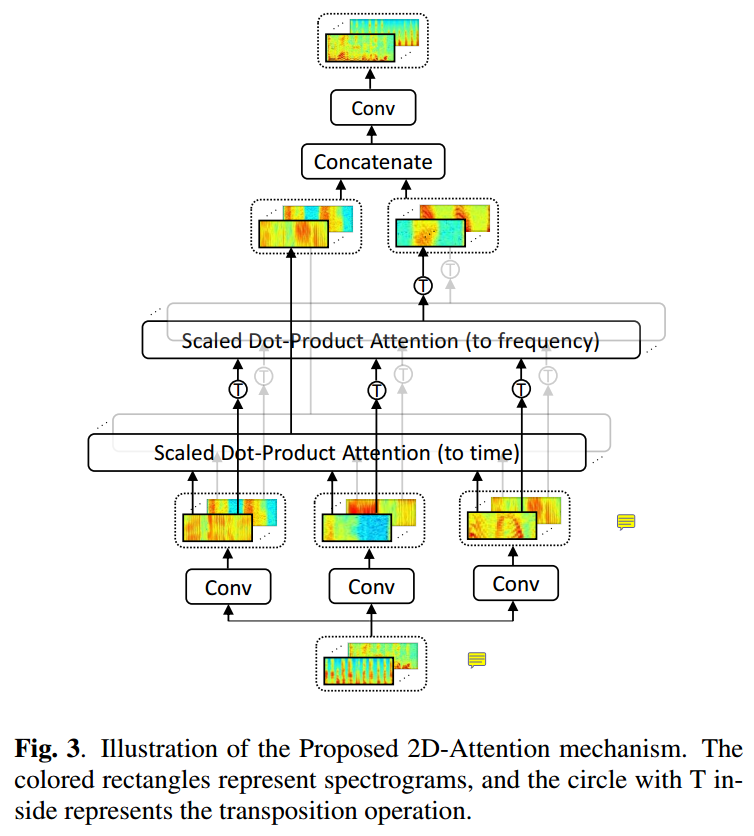
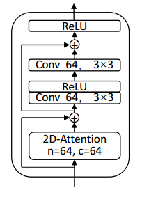

# ASR-Transformer-plus-2DAttention
A tensorflow2.0 implementation of Speech Transformer [1], an end-to-end automatic speech recognition with [Transformer](https://arxiv.org/abs/1706.03762) [4] network, which directly converts acoustic features to character sequence using a single nueral network.
ps: 2DAttention used for feature extraction ,more details can be found in paper[1]

## Install
- Python3 (recommend Anaconda)
- Tensorflow 2.0 alpha

## Dataset
- **Librispeech**: LibriSpeech is a corpus of approximately 1000 hours of 16kHz read English speech, prepared by Vassil Panayotov with the assistance of Daniel Povey. The data is derived from read audiobooks from the LibriVox project, and has been carefully segmented and aligned.
- *download [Librispeech](http://www.openslr.org/12/) dataset for free* 

## Model
- **model_architecture**

- **input**: The input acoustic features were 80-dimensional filterbanks extracted with a hop size of 10ms and a window size of 25ms, extended with temporal first and second order differences and per-speaker mean subtraction and variance normalization.
- **output**: The output alphabet of target text consisted of 31 classes, 26 lowercase letters, apostrophe, space, unknown tokens, start-of-sequence tokens and end-of-sequence tokens.
- **2D-attention**: described in [1]

- **pre_net**: described in [1]

## Reference
- [1] Linhao Dong, Shuang Xu,and Bo Xu. “Speech-transformer:A no-recurrence sequence-to-sequence model for speech recognition” in ICASSP 2018
- [2] Transformer model for language understanding.  See [transformer tutorial](https://www.tensorflow.org/alpha/tutorials/text/transformer)
- [3] A PyTorch implementation of Speech Transformer. See [speech transformer pytorch](https://github.com/kaituoxu/Speech-Transformer)
- [4] Ashish Vaswani, Noam Shazeer, et al. “Attention is all you need” in NIPS 2017

